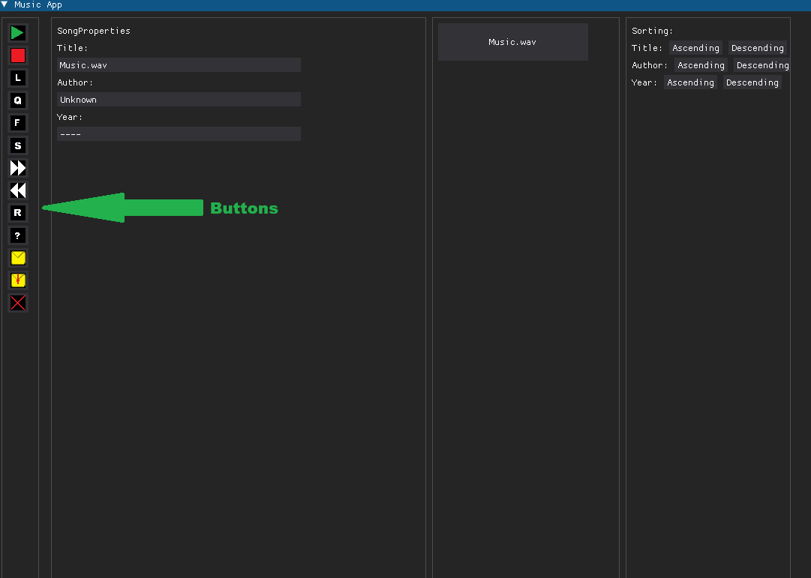
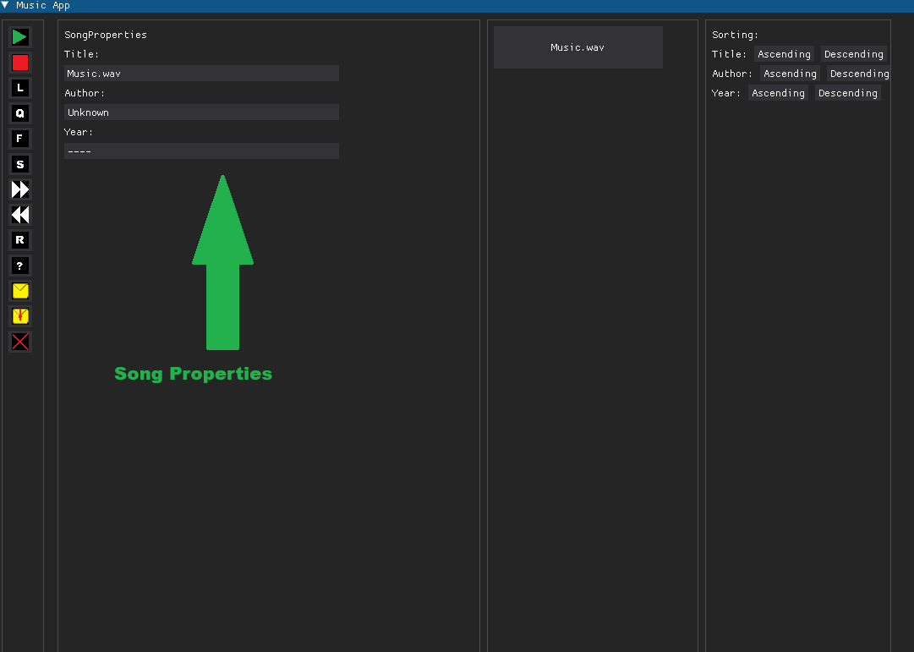
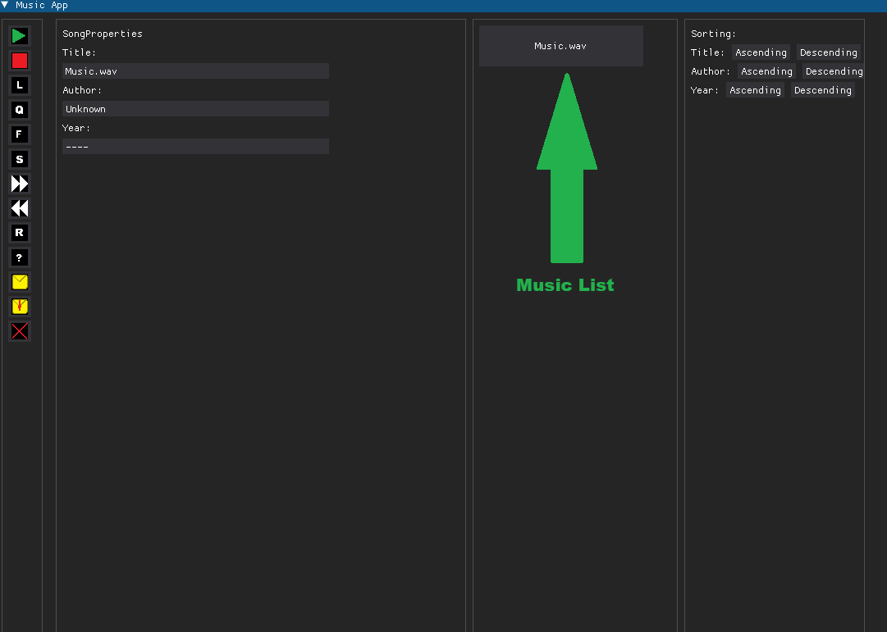
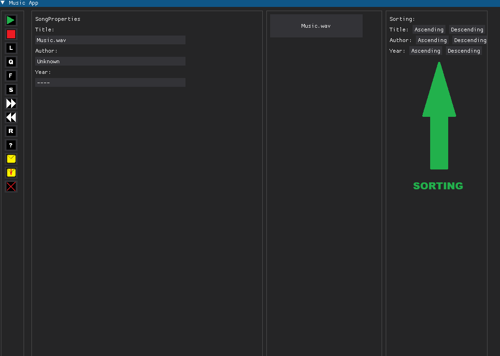

# Music App made in python

## About project
Music App is simple UI for wav file management. It is able to:
  - play/stop music
  - change speed
  - change volume
  - skip forward or backward
  - edit properties (title, author and year)
  - sort music

*It accepts only .wav files*

## Necessary libraries
pygame 
wave 
dearpygui

## How to use this app
Buttons:

They are for wav file management.
From top to down:
 - play
 - stop
 - louder
 - quieter
 - faster
 - slower
 - skip forward
 - skip backward
 - reset
 - info (about wav file)
 - import file
 - save
 - exit program

Song properties:

Here all music properties are shown.
User can modify them.
They will be saved and load when user will open app again.

Song list:

Here all imported wav files are shown.
Click on button with song's title to select song and see its properties.

Sort:

Click on button to sort song list.

## How it works
When User imports song program creates a new intances of "Song" class. Each instance stores one song. After that song list will be updated. Song's index is a song position on SongList. Every new song has an default title, author and year - user can change it later. 
When User click save button all properties from every instance will be saved to txt file and will be recreated when the program will start again. 
When new song is selected program first aplys all modifiers (faster/slower or louder/quieter), then the new temporary wav file will be created in order to not modify the original file. When user change speed, program will create a new temporary wav file.
